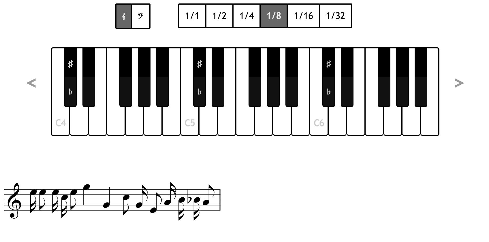

# pianoKeyboard
A flexible virtual piano keyboard based on HTML, CSS and JavaScript.
You can embed the piano in your website with only a few lines of JavaScript. The piano will create [Plaine & Easie](http://www.iaml.info/plaine-easie-code) music code and can render it to a SVG displaying the played notes using the great [Verovio Toolkit](http://www.verovio.org/download.xhtml).




# Usage
## Requirements
The keyboard and the Verovio Toolkit work on any recent browser (for Internet Explorer version 10 is required).

## Installation
For the piano display you  ned the `piano.js` and `piano_style.css` files and jQuery.
If you want to display the played notes in musical notation, you also need to reference the [Verovio Toolkit](http://www.verovio.org/download.xhtml).

Embed it like this:

```HTML
<link rel="stylesheet" href="piano_style.css">
<script src="https://ajax.googleapis.com/ajax/libs/jquery/2.2.4/jquery.min.js"></script>
<script src="http://www.verovio.org/javascript/latest/verovio-toolkit.js"></script> <!--Only needed for notes display-->
<script src="piano.js"></script>
```

The Piano makes only basic use of jQuery, so any version of jQuery should work fine.

## Basic Use
The Piano can be displayed inside any container with enough size.

Add an empty `div for the piano and one for the notes display:

```HTML
<div id="keyboardContainer"></div><!-- this will hold the keyboard -->
<div id="svgNotesContainer"></div><!-- this will hold the SVG with rendered notes -->
```

You can now have the keyboard rendered inside that div:

```JavaScript
<script type="text/javascript">

    $( document ).ready(function() {
        //create piano with 3 octaves, starting at C4 (lowest key)
        //shows labels and octave shift buttons
        var keyboardHTML = htmlForKeyboardWithOctaves(3, octaves.C4, true, true)
        //render the keyboard in the div
        $("#keyboardContainer").html(keyboardHTML)
        //when keys are pressed updatePreview() is called
        bindKeysToFunction(updatePreview)
        //when the clef is changed updatePreviewWithClef() is called
        bindClefSelectionToFunction(updatePreviewWithClef)
        //set the default clef to G4
        setSelectedClef(clefs.G4)
    })

    //this stores all keyboard input
    var plaineEasieCodes = []
    var selectedClef = clefs.G4

    //this is called whenever a piano key is pressed
    function updatePreviewWithNote(sender, paeNote) {
        console.log("key pressed is " + paeNote)
        plaineEasieCodes.push(paeNote)
        updateNotesSVG()
    }

    //this is called when the user changes the clef for display
    function updatePreviewWithClef(sender, clef) {
        console.log("clef changed to " + clef)
        selectedClef = clef
        updateNotesSVG()
    }

    function updateNotesSVG() {
        //render the notes to an SVG using the Verovio tookit
        //width of the svg is 800px and note scaling 50%
        var notesSVG = svgNotesForPlaineEasieCode(plaineEasieCodes.join(""), selectedClef, 800, 50)
        //insert thes SVG code in our div
        var svgContainerDiv = $('#svgNotesContainer')
        svgContainerDiv.html(notesSVG)
    }

</script>
```

This creates a piano keyboard in the `keyboardContainer` and adds a callback function `updatePreviewWithNote()` that is called whenever a key is pressed on the keyboard.

The `updatePreviewWithNote()` function takes the last played note in Plaine and Easie format and appends it to the `plaineEasieCodes` array. In the `updateNotesSVG()` the codes in that array are joined to a single string and sent to the `svgNotesForPlaineEasieCode()` function.

The `svgNotesForPlaineEasieCode` function takes a Plaine & Easie code and returns the notes rendered in SVG format using the Verovio Toolkit. We then put this in our `notesSVG` div.


## Configuration

### Keyboard functionality
To create a piano keyboard you use the function

```JavaScript
function htmlForKeyboardWithOctaves(numberOfOctaves, startOctave, showLabels, withShiftButtons, withNoteSelection, withClefSelection)
```
With the following options:

* `numberOfOctaves`: Number. How many octaves are displayed
* `startOctave`: the lowest displayed octovate. Use the `octaves` object to select an octave like `octaves.C4`
* `showLabels`: Bool - default true. Sets whether the first keys of each octave have labels indicating their pitch
* `withShiftButtons`: Bool - default true. Sets whether on the left and right side of the keyboard arrows buttons are displayed for the user to shift octaves up or down
* `withNoteSelection`: Bool - default true. Sets whether buttons are displayed to select the note length (like half, quarter, eigth, etc.)
* `withClefSelection`: Bool - default true. Sets whether a button is displayed to switch between bass and violin clef (this is only relevant for display and does not affect the Plaine and Easie code)

To actually react on pressed keys you need to register a callback function that is called when a key is pressed. For example:
```JavaScript
//when keys are pressed updatePreview() is called
bindKeysToFunction(updatePreview)
```
The callback function should have a signature like
```
function updatePreview(sender, paeNote) {
    console.log(paeNote)
}
```
The `sender` is the dom object that was clicked by the user. The `paeNote` is the Plaine And Easie code of the pressed key.


You also need to register a callback function for when the user changes the clef (if you have clef selection activated). For example:
```JavaScript
//when the clef is changed updatePreviewWithClef() is called
bindClefSelectionToFunction(updatePreviewWithClef)
```
The callback function should have a signature like
```
function updatePreviewWithClef(sender, clef) {
    console.log(clef)
}
```
The `sender` is the dom object that was clicked by the user. The `clef` is the new selected clef.

Usually both callback functions are used to re-render the displayed notes but could also be used to play sounds, for insance. (Midi sounds can be generated with the Verovio Toolkit)

### Notes rendering
The `piano.js` offers a convenience function to render the Plaine And Easie code to a SVG with musical notation. That function `svgNotesForPlaineEasieCode()` encapsulates the Verovio Toolkit. You can of course use the [Verovio Toolkit directly](http://www.verovio.org/javascript.xhtml), which gives you more control about display.

To conveniently render notes in SVG use the following function:

```JavaScript
function svgNotesForPlaineEasieCode(paeCode, clef, width, scalePercent)
```
With the following options:

* `paeCode`: String. The Plaine and Easie code to render
* `clef`: String. The clef to use. Recommended to use the `clefs` object to select a like `clefs.G4`
* `width`: Number - Sets the width of the created SVG canvas
* `scalePercent`: Number - The scale (= size) of the rendered notes. This is a percent value. For most cases between 20 and 80

### Layout and Styling
The most part of the styling happens in the `piano_style.css`. You can overwrite the style or change them directly to change the appearance of the keyboard.


## Known Issues
### Keyboard size
Currently the keyboard / key size is set fixed in the `piano_style.css`.

If you have an idea how to make the keyboard scale depending on its container size, please create a pull request.

# License and Contribution
pianoKeyboard was developed by Anna Neovesky and 
Gabriel Reimers at the [Digital Academy](https://www.digitale-akademie.de) of the [Academy of Sciences and Literatur | Mainz](https://www.adwmainz.de)
 
This framework is license under MIT License.
Any contributions in form of bug reports or pull requests are welcome.

The [Verovio Framework](https://github.com/rism-ch/verovio) is developed by the [Swiss RISM Office](http://rism-ch.org/), licensed under LGPL and is not affiliated with this project.


